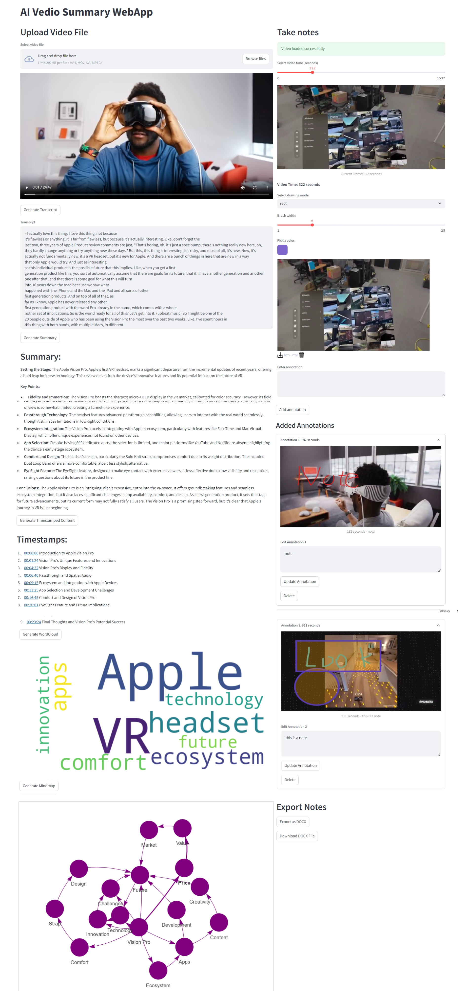
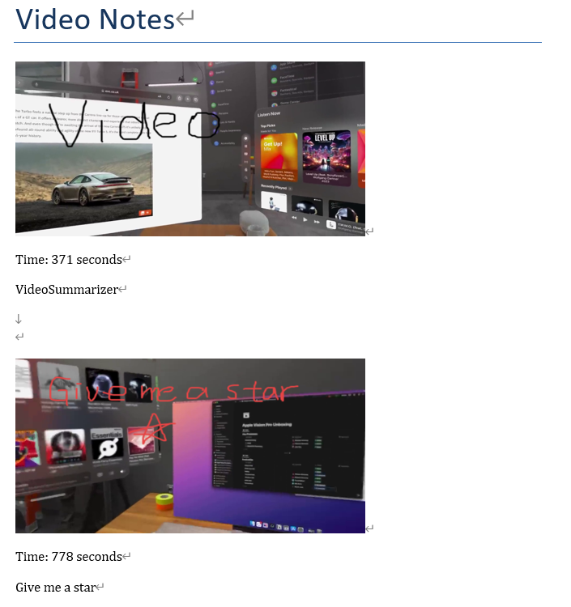

# VideoSummarizer
本项目为采用streamlit搭建，实现了简单的视频可视化笔记。
- 视频上传（注意这里需要上传本地的youtube视频，命名方式:如果视频url为：`https://www.youtube.com/watch?v=86Gy035z_KA86Gy035z_KA.mp4` 则需要命名为`86Gy035z_KA.mp4`）
- 字幕提取，采用[youtube-transcript-api](https://github.com/jdepoix/youtube-transcript-api) 工具
- 视频摘要和时间戳生成
- 词云和关系图谱生成
- 滑块实时拖拽截图，选择笔刷模式颜色绘制，添加当前时间的批注
- 可折叠并编辑的笔记展示区域
- 笔记图文以docx导出
### 启动项目
```
 streamlit run app.py
```

### 注意事项
1. 本项目采用deepseek api，需要创建.env文件，放入内容`API_KEY="YOUR-API-KEY"`
2. youtube-transcript-api工具近期不保证稳定性
3. 在以上项目的基础上增加功能:笔记部分批注语音转文字，左侧边栏截图对象提取与识别，生成对象边缘的词云。见项目[Video-Summarizer](https://github.com/strangersinsist/Video-Summarizer)
### 使用效果
主app:


导出docx:


